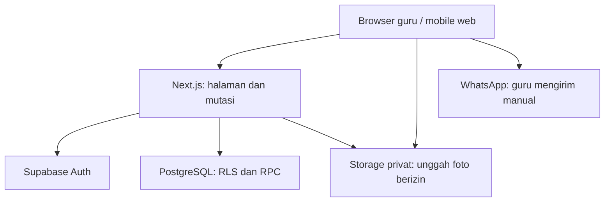
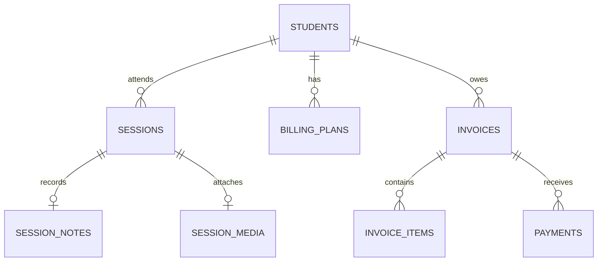

# Teman Les — PRD dan Technical Design Document

Versi 1.0 • 30 September 2026 • Bahasa Indonesia  
Status: siap menjadi dasar implementasi MVP dan uji pilot; keputusan default di bawah adalah usulan produk, bukan seluruhnya hasil validasi pengguna.  
Nama “Teman Les” adalah nama kerja, dapat diganti.  
Stack yang diminta: Next.js + Supabase + Tailwind CSS. Pengalaman utama: mobile-first web.

## Daftar isi

- Bagian A — Product Requirements Document: konteks, tujuan, cakupan, alur, aturan bisnis, acceptance criteria, desain, pilot.
- Bagian B — Technical Design Document: arsitektur, database, transaksi, akses, kontrak aplikasi, media, pengujian, deployment.
- Bagian C — Rencana implementasi dan keputusan terbuka.

# BAGIAN A — PRODUCT REQUIREMENTS DOCUMENT

## A1. Ringkasan produk

Teman Les membantu guru les mandiri mengatur kegiatan mengajar dari HP: melihat jadwal, mengingat catatan pertemuan sebelumnya, mencatat hasil sesi dalam waktu singkat, mengetahui tagihan yang belum dibayar, dan membagikan perkembangan anak kepada orang tua.

Dua masalah utama yang ditangani bersama adalah ketidakjelasan pencatatan pembayaran dan komunikasi perkembangan anak. Jadwal serta riwayat sesi menjadi dasar kedua fungsi tersebut. Target awal adalah tiga guru les mandiri dengan pola mendatangi rumah murid. Produk gratis selama pilot; tidak ada monetisasi pada MVP.

Janji produk: “Selesai mengajar, catatan rapi, pembayaran jelas, orang tua memahami proses belajar.” Produk tidak menjanjikan kenaikan nilai atau menggantikan penilaian profesional guru.

## A2. Bukti, asumsi, dan batas validasi

| Kategori | Informasi |
|---|---|
| Diketahui dari satu guru | Mengajar sendiri, mendatangi rumah murid, jenjang SD, memiliki 7 murid, jadwal mingguan tetap namun belum dicatat. |
| Diketahui dari satu guru | Mayoritas pembayaran bulanan; sebagian harian; pernah terjadi kendala pembayaran. Belum diketahui jumlah uang dan frekuensinya. |
| Diketahui dari satu guru | Absen murid bulanan tidak otomatis mengurangi biaya. Pindah jadwal mengikuti ketersediaan guru. |
| Diketahui dari satu guru | Guru mengetahui kesulitan anak; pernah disalahkan setelah nilai ujian kurang baik. Riwayat komunikasi sebelum ujian belum terkonfirmasi. |
| Akses pilot | Ada dua guru lain dengan pola mengajar serupa; kebutuhan dan tingkat masalah mereka belum divalidasi secara rinci. |
| Asumsi untuk diuji | Guru mau mencatat rutin, orang tua merasa laporan berguna, dan manfaat lebih besar daripada beban input. |
| Belum dibuktikan | Kemauan membayar, pengurangan keluhan, perbaikan nilai, permintaan pengiriman otomatis, kebutuhan video. |

## A3. Pengguna dan hak akses

### Guru — pengguna utama

Guru mengelola murid miliknya sendiri, jadwal, catatan, tagihan, pembayaran, dan laporan. Satu akun mewakili satu guru mandiri. Tidak ada organisasi multi-guru pada MVP.

### Orang tua — penerima informasi

Orang tua menerima teks laporan atau tagihan lewat WhatsApp dan, bila guru memilih, berkas foto melalui perangkat. Orang tua tidak perlu membuat akun, login, memasang aplikasi, atau membuka portal khusus.

### Pengelola pilot

Ju membantu onboarding dan menerima feedback. Tidak dibuat dashboard admin untuk membaca seluruh data anak. Dukungan menggunakan informasi minimum yang dibagikan guru; akses operasional database terbatas dan dicatat.

## A4. Tujuan dan ukuran keberhasilan

Pilot berlangsung satu bulan penuh agar mencakup siklus pembayaran. Angka berikut adalah target usulan, bukan hasil yang sudah tercapai.

| Ukuran | Definisi / target |
|---|---|
| Aktivasi | Ketiga guru berhasil menambahkan minimal satu murid, jadwal, dan mencatat satu sesi dengan bantuan onboarding singkat. |
| Penggunaan berulang | Minimal 2 dari 3 guru mencatat ≥70% sesi yang benar-benar terlaksana selama pilot. Denominator dikonfirmasi lewat review mingguan, bukan dihitung hanya dari sesi yang dicatat. |
| Kecepatan input | Median pengisian catatan tanpa foto ≤60 detik pada pengamatan penggunaan nyata. |
| Manfaat pembayaran | Ada contoh konkret guru menemukan/mengonfirmasi tagihan atau pembayaran yang sebelumnya tidak jelas. |
| Manfaat komunikasi | Minimal dua orang tua dari keluarga berbeda menyatakan informasi membantu memahami kesulitan atau langkah belajar; catat feedback langsung, bukan asumsi dari klik bagikan. |
| Integritas | Nol kebocoran antar-guru dan nol tagihan/pembayaran duplikat pada skenario retry yang diuji. |

Jika guru tidak rutin mencatat, observasi langkah yang merepotkan sebelum menambah fitur. Pilot gratis menguji kegunaan, bukan validasi willingness to pay.

## A5. Cakupan rilis

### P0 — wajib sebelum pilot

1. Login, logout, reset password, dan profil guru.
2. Tambah/edit/arsip murid serta kontak orang tua.
3. Tarif dan model pembayaran per murid: bulanan atau per sesi.
4. Jadwal mingguan berulang, sesi ad hoc, pindah satu sesi, izin/batal.
5. Beranda hari ini dan catatan terakhir anak.
6. Catatan hasil sesi singkat dan riwayat belajar per murid.
7. Tagihan bulanan, biaya per sesi selesai, pembayaran sebagian, pembatalan pencatatan pembayaran.
8. Pratinjau laporan dan pengingat tagihan berbasis template; bagikan teks via WhatsApp atau salin teks.
9. Koreksi data dengan jejak perubahan pada operasi penting.
10. Isolasi data, states loading/error/empty, dan penggunaan dari HP.

### P1 — penyempurna pilot setelah alur P0 stabil

- Satu foto hasil latihan per sesi, opsional, privat; unggah dan unduh untuk dibagikan manual.
- Penanda kemajuan pada topik yang sama berdasarkan catatan guru.
- Ringkasan bulanan pendapatan diterima dan tagihan tersisa.
- Ekspor data guru ke CSV untuk portabilitas; wajib tersedia sebelum pilot berakhir, boleh melalui proses dukungan terautentikasi terlebih dahulu.

### Di luar MVP

Video, AI penulis laporan, penilaian otomatis dari foto, payment gateway, WhatsApp Business API dan pengiriman otomatis, notifikasi push, akun orang tua, tautan publik laporan, marketplace guru, grup kelas, organisasi multi-guru, payroll, pembukuan akuntansi lengkap, offline sync, gamifikasi/streak, dan aplikasi native.

Tidak diperlukan AI untuk menghasilkan laporan awal; template dari input guru cukup. Pengiriman otomatis adalah fase lanjutan dengan persetujuan penerima, pengelolaan biaya, retry, dan bukti delivery yang harus dirancang terpisah.

## A6. Informasi dan navigasi

Navigasi bawah pada HP: **Hari ini • Murid • Tagihan**. Riwayat terdapat di detail murid dan sesi; profil/pengaturan dibuka dari avatar. Ini penyempurnaan prototipe agar penambahan serta pengelolaan murid memiliki tempat jelas.

| Layar | Informasi utama | Aksi utama |
|---|---|---|
| Login | Email, password, lupa password | Masuk |
| Onboarding | Nama guru, zona waktu, murid pertama | Tambah murid |
| Hari ini | Sesi terurut waktu, status, sesi yang belum dicatat, akses tanggal | Buka sesi |
| Detail sesi | Anak, waktu, lokasi singkat, catatan terakhir | Selesai mengajar |
| Catatan sesi | Topik, pemahaman, catatan/lanjutan opsional | Simpan |
| Pratinjau laporan | Isi yang akan dibagikan, nama orang tua | Bagikan via WhatsApp |
| Daftar murid | Nama, kelas, status aktif | Tambah murid |
| Detail murid | Jadwal, tarif, riwayat, tagihan | Catat sesi / ubah |
| Tagihan | Periode, sisa tagihan, status | Buka tagihan |
| Detail tagihan | Rincian, pembayaran, sisa | Catat pembayaran |
| Profil | Nama, zona waktu, logout, permintaan ekspor/hapus akun | Simpan perubahan |

## A7. Alur utama

### A7.1 Onboarding

Guru login → isi nama → tambah murid → isi kontak orang tua dan kelas → pilih model tarif → isi tarif, tanggal mulai, jatuh tempo → tambah jadwal mingguan → beranda siap.

Data minimum murid: nama panggilan/nama, kelas, nama orang tua, nomor WhatsApp, jenis tarif, nominal, tanggal mulai. Alamat singkat opsional; lokasi GPS dan tanggal lahir tidak diperlukan. Nomor orang tua dapat dilewati saat onboarding tetapi wajib sebelum WhatsApp diarahkan ke penerima tertentu.

### A7.2 Mengajar dan mencatat

Buka sesi → lihat materi serta kesulitan terakhir → selesai mengajar → isi materi dan pilih pemahaman → simpan → lihat laporan → opsional bagikan. Catatan tersimpan walau pengguna tidak membagikan laporan.

Input wajib: topik/materi (1–120 karakter setelah trim) dan pemahaman: `Mandiri`, `Masih perlu bantuan`, `Perlu diulang`. Catatan/latihan berikutnya maksimal 300 karakter, opsional. Tanggal, murid, waktu, dan model tarif sudah terisi dari sesi.

“Lanjut materi sebelumnya” menyalin topik saja; nilai pemahaman tidak disalin otomatis. Guru dapat menambahkan sesi yang lupa dicatat dengan tanggal lampau yang valid. Sesi mendatang tidak boleh diselesaikan sebelum waktu mulai, kecuali waktunya diedit menjadi waktu aktual.

### A7.3 Pembayaran

Buka Tagihan → pilih murid/periode → lihat rincian → pilih Catat pembayaran → nominal, tanggal diterima, metode tunai/transfer → konfirmasi → tampilkan status dan sisa baru.

Tidak ada aksi “lunas” yang mengubah status tanpa catatan penerimaan uang. Tombol pintasan “Bayar seluruh sisa” hanya mengisi nominal form, bukan menyimpan otomatis.

### A7.4 Perubahan jadwal

Buka sesi → Pindah jadwal → tanggal/jam baru → pemeriksaan bentrok → simpan. Sesi tetap memiliki identitas yang sama, sehingga tidak menimbulkan biaya kedua. Jadwal berulang lainnya tidak ikut berubah.

Mengubah jadwal rutin meminta tanggal efektif; hanya sesi mendatang berstatus terjadwal yang diregenerasi. Sesi selesai, izin, batal, atau yang sudah dipindahkan manual tetap dipertahankan. Hari libur tidak otomatis membatalkan jadwal.

### A7.5 Orang tua menerima laporan

Guru membaca pratinjau → sistem membuka WhatsApp berisi teks → guru memilih/memeriksa penerima dan menekan Kirim di WhatsApp. Aplikasi hanya mencatat “WhatsApp dibuka”, bukan “terkirim” atau “dibaca”. Jika WhatsApp tidak tersedia, tampilkan opsi Salin teks.

Foto tidak otomatis menjadi lampiran pada link WhatsApp. Guru dapat memakai share file perangkat jika tersedia atau unduh foto lalu lampirkan manual. Tidak membuka halaman publik berisi data anak.

## A8. Aturan bisnis yang mengikat implementasi

### Jadwal dan sesi

- Zona waktu default Asia/Jakarta; jadwal mingguan menggunakan hari dan jam lokal guru. Waktu sesi konkret disimpan sebagai instant UTC.
- Satu guru tidak dapat membuat dua sesi aktif yang waktunya tumpang tindih; interval akhir tidak inklusif sehingga 15.00–16.00 dan 16.00–17.00 diperbolehkan. Waktu perjalanan belum dihitung otomatis; jadwal menampilkan lokasi singkat agar guru menilai jedanya.
- State sesi: `scheduled`, `completed`, `student_absent`, `teacher_cancelled`. Pindah jadwal adalah event perubahan waktu, bukan sesi baru.
- Sesi yang terlewat waktunya tetap scheduled dengan label “Belum dicatat”; tidak otomatis dianggap selesai atau absen.
- Izin dan pembatalan tidak menghasilkan biaya per sesi. Sesi pengganti disepakati manual; jika sesi lama diubah waktunya, gunakan ID yang sama. Jika dibuat pengganti untuk sesi absen, simpan tautan pengganti dan hanya sesi yang completed yang ditagih.
- Tidak ada perhitungan refund otomatis untuk pembatalan guru pada murid bulanan. Guru dapat memberi potongan eksplisit dengan alasan, atau menjadwalkan pengganti.

### Tarif

- Nominal menggunakan Rupiah bulat positif, tanpa floating point dan tanpa pajak/biaya tambahan pada MVP.
- Bulanan berarti bulan kalender lokal, bukan setiap 30 hari. Jatuh tempo default tanggal 5, dapat diubah 1–28 per murid.
- Murid mulai tengah bulan: tidak prorata otomatis. Guru melihat nominal bulan pertama dan dapat memberi potongan dengan alasan sebelum menerbitkan tagihan.
- Tarif harian pada UI dijelaskan sebagai **per sesi selesai**, satu sesi = satu pertemuan. Dua sesi nyata dalam satu hari dapat ditagih dua kali; sesi duplikat tidak boleh muncul dari retry.
- Perubahan tarif rutin berlaku mulai bulan berikutnya; tarif lama tidak ditimpa pada catatan historis. Koreksi tagihan berjalan memakai adjustment eksplisit.

### Tagihan

- Satu invoice per murid per bulan; invoice menyimpan snapshot jenis tarif dan nomor tagihan unik dalam akun guru.
- Bulanan: satu baris biaya bulanan, tidak dipengaruhi jumlah absen. Dibuat sekali saat periode aktif dibuka/generator dijalankan. Tidak membuat tagihan sebelum enrollment dimulai atau sesudah tanggal berhenti.
- Per sesi: setiap sesi selesai menambahkan satu charge unik pada invoice sesuai bulan lokal pelaksanaan. Sesi lintas bulan menggunakan tanggal mulai aktual setelah reschedule.
- Total tagihan = jumlah baris biaya aktif + adjustment bertanda (+/-). Total tidak boleh negatif.
- Sisa = total − pembayaran aktif. Dilarang menyimpan sisa negatif; kelebihan bayar/kredit saldo tidak didukung pada MVP.
- Status turunan: total 0 → `no_charge`; dibayar 0 dan total >0 → `unpaid`; 0 < dibayar < total → `partial`; dibayar = total >0 → `paid`. `overdue` adalah flag jika hari lokal melewati due date dan sisa >0.
- Selesai mengajar tidak menandai pembayaran lunas. Membuka laporan/pesan tidak menandai pembayaran lunas.
- Invoice per sesi yang sebelumnya lunas bisa memiliki sisa lagi saat sesi baru ditambahkan dalam bulan yang sama. UI menjelaskan “Ada sesi baru” melalui rincian, bukan menganggap pembayaran lama hilang.
- Mengarsipkan murid menghentikan sesi dan tagihan masa depan sejak tanggal akhir; invoice berjalan dan tunggakan tetap dapat dilihat serta dibayar.

### Pembayaran dan koreksi

- Pembayaran harus >0 dan ≤sisa, dengan tanggal hari ini/lampau; metode transfer/tunai. Satu pembayaran dialokasikan ke satu invoice.
- Saldo awal pilot dicatat sebagai invoice periode terkait dengan baris `opening_balance` dan keterangan, bukan sesi fiktif. Pembayaran lama boleh dicatat dengan tanggal sebenarnya.
- Edit nominal pembayaran dilakukan dengan membatalkan record lama beserta alasan lalu mencatat record baru; record lama tidak dihapus.
- Koreksi topik/catatan tidak mengubah tagihan. Reopen sesi completed menghapus efek charge secara transaksional, hanya jika total baru tetap ≥pembayaran aktif. Jika melanggar, tampilkan penjelasan untuk mengoreksi pembayaran yang salah atau menunda koreksi hingga pengembalian uang nyata diselesaikan; aplikasi tidak mengarang refund.
- Pembatalan pencatatan pembayaran berarti membetulkan buku catatan, bukan memindahkan atau mengembalikan uang.
- Reopen sesi mempertahankan revision history dan meminta alasan. Jika laporan sudah dibagikan di luar aplikasi, tampilkan pengingat untuk mengirim koreksi; teks lama di WhatsApp tidak dapat ditarik oleh aplikasi.

### Perkembangan

- Pemahaman adalah observasi guru terhadap topik pada sesi itu; bukan nilai ujian, skor kemampuan keseluruhan, atau diagnosis.
- Kemajuan hanya dibandingkan pada topik yang sama. Topik memiliki ID agar beda ejaan tidak dianggap otomatis sebagai topik baru tanpa pilihan guru.
- Tidak menghasilkan klaim “naik 80%”, peringkat murid, atau jaminan nilai meningkat dari tiga pilihan pemahaman.
- Laporan hanya memuat data yang memang dicatat; bagian kosong dihilangkan. Guru selalu dapat melihat teks sebelum membagikannya.

## A9. Requirement dan acceptance criteria

| ID | Requirement | Acceptance criteria |
|---|---|---|
| FR01 | Auth | Pengguna belum login diarahkan masuk; sesi kedaluwarsa meminta login kembali; setiap operasi tetap memvalidasi identitas di server. |
| FR02 | Murid | Tambah/edit berhasil; nama wajib; nomor dinormalisasi; arsip tidak menghilangkan tagihan historis. |
| FR03 | Jadwal | Jadwal mingguan menghasilkan satu occurrence per tanggal; refresh/retry tidak menggandakan; bentrok waktu ditolak. |
| FR04 | Reschedule | Satu sesi berpindah waktu tanpa sesi/charge ganda; riwayat waktu lama dan baru tercatat. |
| FR05 | Catatan | Materi dan pemahaman wajib; catatan opsional; keberhasilan hanya ditampilkan setelah transaksi sukses. |
| FR06 | Riwayat | Detail anak hanya menampilkan sesi milik guru yang login; urutan terbaru dahulu; catatan terakhir tersedia sebelum mengajar. |
| FR07 | Bulanan | Dua kali generator pada periode sama tetap satu biaya; absen tidak mengubah nominal. |
| FR08 | Per sesi | Satu completed session tepat satu charge; absen/batal tidak ditagih; tanggal sesi menentukan bulan. |
| FR09 | Pembayaran | Mendukung sebagian; dua pembayaran bersamaan tidak menghasilkan overpayment; retry request yang sama tidak menggandakan. |
| FR10 | Koreksi | Reversal beralasan mempertahankan record; pengurangan tagihan di bawah total dibayar ditolak. |
| FR11 | Laporan | Teks mencerminkan catatan tersimpan; WhatsApp handoff tidak diberi label terkirim; salin teks tersedia. |
| FR12 | Foto P1 | Maksimal satu foto yang memenuhi batas; hanya pemilik dapat membaca; gagal foto tidak membatalkan catatan yang sudah tersimpan. |
| FR13 | UX | Seluruh tugas utama berjalan di lebar 360px tanpa scroll horizontal; tombol dapat disentuh; error tidak menghapus input. |
| FR14 | Portabilitas | Guru bisa memperoleh data sendiri; ekspor mengecualikan guru lain dan melindungi CSV formula injection. |

## A10. Mobile-first dan karakter pengalaman

Arah desain: hangat, personal, rapi. Manfaat emosional yang dituju: guru merasa siap sebelum les, lega setelah mencatat, dan percaya diri saat memberi kabar kepada orang tua.

- Layout dasar satu kolom pada 360–430px, minimum didukung 320px. Tablet 768px dan desktop 1024px memakai ruang tambahan untuk daftar + detail, dengan alur sama.
- Target sentuh minimum 44×44px; field teks 16px; label selalu terlihat; kontras teks normal minimum 4.5:1. Status memakai teks, tidak hanya warna.
- Bottom navigation memperhitungkan safe-area. Tombol simpan tidak tertutup keyboard; bila keyboard muncul, form tetap dapat digulir dan fokus terlihat.
- Form sesi: topik autocomplete, satu pemilihan pemahaman, satu catatan opsional. Foto ditempatkan sekunder.
- Loading mempertahankan struktur; submit pending menonaktifkan aksi ganda namun idempotensi tetap ditangani server.
- Empty state menawarkan satu aksi berikutnya, bukan statistik nol yang memenuhi layar.
- Keberhasilan: centang/transisi 150–200ms dan teks spesifik “Catatan Alya tersimpan”. Hormati reduced motion; tidak ada confetti/streak yang menekan pengguna.
- Error: “Catatan belum tersimpan. Coba lagi.” Jangan tampilkan sukses jika offline. Input tetap ada selama layar terbuka; navigasi keluar dengan perubahan belum tersimpan meminta konfirmasi.
- Hindari menyimpan data anak di localStorage pada MVP. Tidak menjanjikan kemampuan offline; logout menghapus state klien.

Token desain awal (dapat disempurnakan saat UI): canvas #F7F8F3, surface #FFFFFF, teks #203831, aksen utama #285C44, latar aksen #E7EFE5, border #DCE5DF. Warna error/sukses harus diuji kontrasnya. Font sans humanis, misalnya font sistem terlebih dahulu; radius card 16px, control 10–12px; spacing kelipatan 4px. Definisikan token CSS agar tidak tersebar sebagai warna acak.

Microcopy: “Belajar apa hari ini?”, “Masih perlu latihan di bagian apa?”, “Uang sudah diterima?”, “Lihat laporan”. Selalu pisahkan catatan belajar dan informasi pembayaran dalam pesan yang berbeda.

## A11. Privasi dalam alur produk

Gunakan data minimum. Foto hasil latihan lebih diutamakan daripada wajah anak. Sebelum upload pertama, guru mengonfirmasi izin orang tua untuk menyimpan/membagikan foto dan dapat mencatat tanggal izin. Persetujuan dapat ditarik; upload baru ditutup dan foto terkait dapat dihapus. Ini keputusan desain privasi, bukan penetapan kepatuhan hukum.

Foto bersifat privat, tidak memiliki public URL permanen. Sebelum membagikan teks, tampilkan nama anak dan penerima. Akun orang tua, publikasi profil, dan pencarian data anak di internet tidak termasuk produk.

## A12. Contoh laporan

> Halo Ibu Rina, berikut catatan belajar Alya hari ini, 30 September 2026.
>
> Materi: perkalian dua angka.
> Pemahaman: masih perlu bantuan.
> Catatan: sudah lancar mengalikan, masih perlu latihan menyimpan angka. Pertemuan berikutnya kita ulang bagian ini.
>
> Terima kasih sudah mendampingi proses belajarnya.
> — Bu Sari

Contoh pengingat terpisah:

> Halo Ibu Rina, izin mengingatkan pembayaran les Alya untuk September 2026. Total Rp400.000, sudah diterima Rp150.000, sisa Rp250.000. Jika sudah transfer, boleh kabari saya agar saya cek dan catat. Terima kasih.

# BAGIAN B — TECHNICAL DESIGN DOCUMENT

## B1. Prinsip arsitektur

Bangun satu aplikasi Next.js App Router dengan TypeScript strict. Supabase menyediakan Auth, PostgreSQL, dan private Storage. Tailwind CSS mengatur UI mobile-first. Tidak memerlukan backend terpisah, microservices, Redis, event bus, AI, atau realtime subscription untuk tiga guru awal.

Versi: pilih stable release yang kompatibel ketika repository dibuat, pin exact versions dan commit lockfile. Baseline rancangan mengikuti Next.js App Router modern (konvensi Next.js 16), Supabase JS v2 + @supabase/ssr, serta Tailwind CSS v4. Verifikasi patch/security advisory saat implementasi; dokumen ini tidak mengunci patch yang belum diuji.



Server Components untuk read awal dan layout; Client Components untuk form, interaksi tanggal, pratinjau, dan upload. Server Actions menjadi boundary mutasi aplikasi. Route Handlers hanya untuk kebutuhan HTTP khusus seperti export dan upload authorization. Supabase client server menggunakan cookie pengguna; service role tidak digunakan untuk operasi rutin pengguna.

## B2. Struktur repository

```text
src/
  app/
    (auth)/login/page.tsx
    (auth)/forgot-password/page.tsx
    (auth)/update-password/page.tsx
    auth/confirm/route.ts
    (app)/layout.tsx
    (app)/today/page.tsx
    (app)/students/page.tsx
    (app)/students/new/page.tsx
    (app)/students/[id]/page.tsx
    (app)/sessions/[id]/page.tsx
    (app)/sessions/[id]/complete/page.tsx
    (app)/sessions/[id]/report/page.tsx
    (app)/invoices/page.tsx
    (app)/invoices/[id]/page.tsx
    (app)/settings/page.tsx
    api/media/authorize/route.ts
    api/exports/route.ts
    globals.css
    error.tsx
    not-found.tsx
  components/ui/
  components/layout/
  features/
    students/{actions,queries,schemas,components}/
    scheduling/{actions,queries,schemas,components}/
    sessions/{actions,queries,schemas,components}/
    billing/{actions,queries,schemas,components}/
    reports/{templates,components}/
  lib/
    supabase/{client,server}.ts
    auth/require-user.ts
    money.ts
    dates.ts
    errors.ts
  types/database.ts
  proxy.ts
supabase/
  migrations/
  seed.sql
  tests/
tests/{unit,integration,e2e}/
docs/{PRD,TDD,DECISIONS}.md
```

`proxy.ts` mengikuti panduan SSR untuk refresh cookie/token; bukan satu-satunya pengaman. Setiap action dan query memverifikasi user di boundary server. Jika versi framework yang dipilih berbeda, sesuaikan konvensi resminya tanpa mengubah prinsip otorisasi.

## B3. Model data logis

Semua tabel domain memiliki `id uuid`, `owner_id uuid`, `created_at timestamptz`, dan bila mutable `updated_at`, `version integer`. `owner_id` mengacu ke `auth.users.id` dan tidak boleh diambil dari request klien sebagai sumber kebenaran. Semua FK antartabel domain mengikat pasangan `(owner_id, parent_id)` ke `(owner_id, id)` agar referensi silang tenant gagal di database.

| Tabel | Field utama / tujuan | Constraint penting |
|---|---|---|
| teacher_profiles | id = auth user ID, display_name, timezone default Asia/Jakarta | PK id; hanya pemilik membaca/mengubah |
| students | name, grade, guardian_name, guardian_phone_e164 nullable, address_hint nullable, starts_on, ends_on nullable, archived_at, photo_consent_at, photo_consent_revoked_at | tanggal akhir ≥ mulai; nama nonkosong |
| billing_plans | student_id, effective_month date, mode monthly/per_session, rate_rupiah bigint, due_day | unik student+effective_month; rate >0; due_day 1–28; bulan hari 1 |
| schedule_rules | student_id, weekday 1–7, local_start time, duration_minutes, effective_from, effective_until, timezone, active | durasi 15–240; rentang efektif valid |
| sessions | student_id, schedule_rule_id nullable, occurrence_date nullable, starts_at, ends_at, state, rescheduled_manually, replacement_for nullable, completed_at, version | end > start; unik rule+occurrence_date; FK replacement milik murid/guru sama |
| learning_topics | student_id, name, normalized_name, archived_at | unik owner+student+normalized_name |
| session_notes | session_id, topic_id, understanding, note nullable, version | unik session_id; enum understanding; topik milik murid sesi |
| invoices | student_id, period_start date, mode_snapshot, due_date, invoice_number, lifecycle active/void | unik owner+student+period; nomor unik owner; hari period_start =1 |
| invoice_items | invoice_id, session_id nullable, kind monthly/session/opening_balance/adjustment, amount_rupiah signed bigint, description, state active/void, plan_id nullable | satu active session item per session; satu active monthly item per invoice; adjustment wajib alasan |
| payments | invoice_id, amount_rupiah, received_on, method, state posted/void, void_reason, voided_at | amount >0; void membutuhkan alasan; tidak delete |
| session_media | session_id, object_path, mime_type, byte_size, state pending/ready/deleted, uploaded_at | satu ready media per session; path unik |
| audit_events | entity_type, entity_id, action, actor_id, occurred_at, safe_diff jsonb | append-only; tidak menyimpan token/berkas foto |
| mutation_requests | owner_id, request_key uuid, operation, payload_hash, response jsonb, completed_at | unik owner+operation+key; key sama payload beda ditolak |
| product_events | event_name, occurred_at, actor_id, opaque entity_id optional | tidak berisi nama anak, nomor telepon, teks laporan |

`session_notes` memakai satu topik utama per sesi pada MVP; multi-topik bisa ditambahkan kemudian. Tidak menggunakan JSON besar untuk relasi/tagihan. Snapshot/revision lama yang diperlukan untuk koreksi disimpan melalui audit, hanya dapat dibaca pemilik, dengan retensi mengikuti data sumber.

ERD ringkas:



## B4. Constraint dan indeks

- Unique `(owner_id,id)` pada parent domain untuk composite FK.
- `sessions(owner_id,starts_at)` untuk hari/minggu; `sessions(owner_id,student_id,starts_at desc)` untuk riwayat; `invoices(owner_id,period_start,student_id)`; `payments(invoice_id,state)`; `invoice_items(invoice_id,state)`.
- Partial unique index pada `invoice_items(session_id) WHERE kind='session' AND state='active'` dan pada `invoice_items(invoice_id) WHERE kind='monthly' AND state='active'`.
- Constraint bentrok sesi via GiST exclusion dengan `btree_gist`: pasangan owner sama tidak boleh overlap `tstzrange(starts_at,ends_at,'[)')` untuk state scheduled/completed. Migrasi mengaktifkan extension; handler menerjemahkan conflict ke pesan manusia.
- Jadwal berulang dicek terhadap occurrence yang dimaterialisasi. Sesi yang dibatalkan/absen tidak memblok waktu. Archive menghentikan materialisasi berikutnya.
- Nominal bigint dikirim sebagai integer aman/decimal string sesuai driver; format display saja menggunakan Intl.NumberFormat. Tetapkan batas produk misalnya maksimum Rp100 juta per input untuk berada jauh di bawah Number.MAX_SAFE_INTEGER. Jangan menghitung uang dengan pecahan desimal.
- Database CHECK untuk enum, batas panjang, dan nominal dasar; validasi lintas baris ditangani RPC dengan row locks, bukan hanya form.

## B5. Auth, RLS, dan privileges

Auth MVP: email/password dengan email verification, reset password; undang tiga guru melalui proses onboarding. Registrasi publik dapat dimatikan selama pilot. Redirect auth hanya ke daftar origin yang diizinkan.

Gunakan @supabase/ssr untuk client browser/server. Verifikasi identitas melalui mekanisme verified claims/user sesuai panduan SDK; jangan mempercayai objek session dari cookie tanpa validasi. Render halaman privat secara request-scoped; tidak memasukkan data guru ke shared cache.

RLS diaktifkan pada semua tabel exposed. Pola read sederhana:

```sql
alter table public.students enable row level security;
create policy students_read_own on public.students
  for select to authenticated
  using ((select auth.uid()) = owner_id);
```

Kebijakan insert/update untuk tabel yang boleh langsung ditulis harus memakai `WITH CHECK` selain `USING`. Namun desain ini memilih mutasi domain melalui RPC agar state dan billing tidak dapat dibypass lewat REST client.

- Grant SELECT sesuai RLS kepada authenticated; revoke direct INSERT/UPDATE/DELETE pada sessions, notes, invoices, items, payments, audit, mutation_requests. Terapkan juga pada tabel konfigurasi bila hanya melalui RPC.
- RPC mutasi menggunakan SECURITY DEFINER dengan `SET search_path=''`, seluruh objek schema-qualified, tanpa SQL dinamis. REVOKE EXECUTE dari public/anon; grant hanya fungsi yang diperlukan ke authenticated.
- Karena definer dapat melewati RLS, setiap fungsi wajib mengambil `auth.uid()`, menolak NULL, membaca parent dengan owner tersebut, memvalidasi seluruh related IDs dan aturan sebelum menulis. Jangan menerima owner_id sebagai otorisasi.
- Fungsi read/helper tidak diberi privilege lebih tinggi tanpa kebutuhan. View menggunakan security-invoker jika diekspos atau agregasi dilakukan query di bawah RLS; hindari view definer yang membocorkan data.
- Pengujian sebagai anon, guru A, guru B, serta user JWT langsung ke PostgREST/RPC adalah gate rilis.
- Service role/secret Supabase tidak pernah menjadi NEXT_PUBLIC, tidak dikirim ke browser, dan tidak dipakai untuk semua query demi “memudahkan” RLS.

## B6. Transaksi inti dan idempotensi

### complete_session(session_id, expected_version, note, request_key)

1. Validasi user, input, dan hash payload; ambil/advisory-lock key idempotensi yang dibatasi owner.
2. Jika key sukses sudah ada dengan hash sama, kembalikan respons lama; hash beda → conflict.
3. Lock session FOR UPDATE; cek ownership, state scheduled, expected_version, waktu valid.
4. Simpan note dan update completed dalam transaksi yang sama.
5. Jika per sesi, pilih plan untuk bulan lokal pelaksanaan; ensure invoice lewat unique constraint + upsert aman, lock invoice, insert satu active session item dengan snapshot rate. Jika monthly, ensure biaya bulanan secara idempotent.
6. Tulis audit dan hasil request; commit.
7. Client menerima success lalu melakukan revalidation halaman terkait. Media diunggah sesudah ini dan tidak berada dalam transaksi billing.

Dua request berbeda untuk session yang sudah completed tidak menambah biaya kedua; return conflict/current state. Edit catatan menggunakan action tersendiri dengan expected_version.

### record_payment(invoice_id, amount, date, method, request_key)

Lock invoice → hitung ulang total dan pembayaran posted di database → pastikan 0 < amount ≤sisa → insert payment → audit → simpan hasil idempotensi → commit. Semua mutasi charge/payment pada invoice mengambil lock invoice yang sama. Dua transaksi bersamaan tidak dapat overpay walaupun keduanya melihat sisa lama di UI.

### reopen_session dan adjustment

Urutan lock konsisten: session (bila ada), lalu invoice; untuk beberapa invoice urut UUID agar mengurangi deadlock. Hitung total setelah perubahan, tolak jika di bawah pembayaran posted. Void charge, ubah state sesi, simpan audit dan versi dalam transaksi tunggal. Note dipertahankan sebagai draft/revision; laporan final ditandai tidak lagi berlaku sampai sesi diselesaikan kembali.

### Retention request keys

Simpan sepanjang pilot. Setelah itu, retensi minimum 90 hari sebagai keputusan operasional; unique business constraints tetap melindungi tagihan walaupun key telah dibersihkan. Request UUID dibuat klien sekali per operasi dan digunakan ulang saat retry, bukan dibuat ulang setiap percobaan.

## B7. Materialisasi jadwal dan pembuatan invoice

Tidak perlu cron wajib untuk pilot. Saat membuka agenda, action `ensure_schedule_window(from,to)` mematerialisasi maksimal 60 hari ke depan dari rules milik guru, dengan unique rule+occurrence_date. Bulk insert di transaksi; konflik dilaporkan dengan tanggal dan murid, tidak dilewati diam-diam.

Saat membuka Tagihan, action `ensure_invoices(period)` membuat tagihan bulanan untuk murid eligible dan membawa invoice per sesi yang sudah ada. Maksimal 12 periode per request backfill. Tidak membuat tagihan otomatis untuk bulan sebelum awal penggunaan; saldo awal dimasukkan eksplisit.

Kedua operasi merupakan mutasi eksplisit server, tidak ditempatkan dalam render GET/Server Component. Halaman memanggil initialization action lewat kontrol/komponen idempotent lalu refresh; read-only query tidak memiliki side effect. Job terjadwal dapat ditambahkan kelak dengan algoritme yang sama, bukan logika berbeda.

## B8. Kontrak aplikasi

Server Action adalah API internal; jangan membuka REST paralel untuk operasi yang sama tanpa kebutuhan integrasi.

```ts
type ActionResult<T> =
  | { ok: true; data: T }
  | { ok: false; code: 'VALIDATION' | 'UNAUTHENTICATED' |
      'NOT_FOUND' | 'CONFLICT' | 'PAYMENT_EXCEEDS_BALANCE' |
      'SCHEDULE_OVERLAP' | 'INTERNAL';
      message: string; fieldErrors?: Record<string, string[]> };

type CompleteSessionInput = {
  sessionId: string;
  expectedVersion: number;
  requestKey: string;
  topicId?: string;
  topicName?: string; // tepat satu dari ID atau nama topik baru
  understanding: 'independent' | 'assisted' | 'repeat';
  note?: string;
};
```

| Action / handler | Input pokok | Efek |
|---|---|---|
| createStudent / updateStudent | profile, expectedVersion | Simpan konfigurasi murid |
| setBillingPlan | studentId, effectiveMonth, mode, rate | Tambah plan baru, tidak overwrite histori |
| createScheduleRule | studentId, weekday, start, duration | Buat rule dan occurrence dalam horizon |
| rescheduleSession | sessionId, version, startsAt, endsAt | Ubah occurrence dan audit |
| markSessionAbsent / cancelSession | sessionId, version, reason | Ubah state nonbillable |
| completeSession | kontrak di atas | Note + session + charge atomik |
| updateSessionNote | noteId, version, fields | Koreksi note tanpa charge |
| reopenSession | sessionId, version, reason | Koreksi sesi dan charge dengan guard saldo |
| ensureInvoices | period | Idempotent generation |
| addInvoiceAdjustment | invoiceId, amountSigned, reason | Ubah total dengan guard pembayaran |
| recordPayment / voidPayment | invoice/payment ID, key, fields | Posting/reversal pencatatan |
| POST /api/media/authorize | sessionId, contentType, size | Otorisasi upload privat |
| finalizeMedia | mediaId | Verifikasi objek dan tandai ready |
| GET /api/exports | format, scope | Ekspor pemilik sendiri, no-store |

Gunakan Zod atau validator schema setara di server dan client; schema server tetap authoritative. Forbidden object ID dapat dikembalikan sebagai NOT_FOUND untuk tidak mengungkap keberadaan data orang lain. Error internal menyertakan request ID aman, bukan SQL/token.

## B9. Media privat dan WhatsApp

Bucket `session-photos` private. Path `${ownerId}/${sessionId}/${randomId}.jpg`; jangan gunakan nama anak/nomor telepon sebagai filename. Maksimum satu foto aktif per sesi, input maksimum 5MB, format JPEG/PNG/WebP. HEIC ditolak dengan pesan untuk memilih JPEG atau dikonversi hanya bila pipeline yang diuji tersedia. Video belum didukung.

Alur: sesi tersimpan → server memvalidasi owner/session/izin foto dan membuat pending row → upload terotorisasi → verifikasi byte size, magic bytes, dimensi serta decode server-side → re-encode untuk menghapus metadata EXIF/GPS → tandai ready. Batasi dimensi, misalnya 20 megapiksel input dan sisi terpanjang output 1600px. Kompresi browser adalah optimasi, bukan pemeriksaan keamanan.

Storage RLS membatasi owner path dan relationship session milik user; anon ditolak. Download memakai token pengguna atau signed URL berumur pendek (misalnya 60 detik) hanya setelah verifikasi owner. Jangan simpan signed URL di database; simpan object_path. Penghapusan memastikan objek dan metadata diproses ulang bila salah satu gagal. Pending/orphan dibersihkan berkala melalui maintenance terotorisasi.

WhatsApp: normalisasi nomor Indonesia 08… → +628… dan validasi E.164; link `https://wa.me/{digits}?text={encodeURIComponent(text)}`. Jangan sisipkan foto privat sebagai URL publik. Status event `report_share_opened` hanya berarti handoff dibuka. Clipboard/Web Share API memakai feature detection dan fallback yang jelas. Tampilan laporan di dalam aplikasi tetap privat.

## B10. State, fetching, cache, dan performa

- Read awal lewat Server Components dan supabase server client; queries menyaring owner dan dibatasi RLS.
- Form state lokal; tidak perlu Redux/global store. Loading dan error per aksi. Optimistic state hanya untuk UI yang mudah dibatalkan; nominal uang menunggu respons database.
- Data murid, invoice, laporan memakai no-store/request-scoped fetching. Tidak memakai shared `use cache` untuk data privat tanpa desain tenant cache yang teruji.
- Setelah mutasi, revalidatePath untuk detail/daftar relevan. Cache client dibuang saat logout/pergantian user.
- Riwayat memakai cursor pagination `(starts_at,id)` 20 item; jangan mengunduh seluruh riwayat untuk beranda.
- Target pilot: LCP ≤2,5 detik, INP ≤200ms, CLS ≤0,1 pada pengukuran perangkat/jaringan representatif; waktu simpan tanpa upload p95 <2 detik adalah target yang perlu diukur.
- Supabase Realtime, service worker/offline cache, dan PWA install tidak diperlukan pada rilis awal. Tidak memasukkan response privat ke service worker cache.

## B11. Security dan operasi

- Secrets disimpan di environment deployment, `.env.local` tidak di-commit. `.env.example` berisi nama variabel saja.
- Browser: `NEXT_PUBLIC_SUPABASE_URL`, `NEXT_PUBLIC_SUPABASE_PUBLISHABLE_KEY`. Server: `APP_URL`; secret admin hanya bila job maintenance memerlukannya, modul server-only.
- Origin checks untuk mutasi; auth callback allowlist; jangan izinkan redirect arbitrer dari query string.
- Rate limit per user untuk mutasi/upload; gunakan mekanisme hosting/gateway atau counter Postgres atomik untuk pilot, bukan Map dalam memori yang dianggap global. Initial budget usulan: 60 mutasi/menit/user, 10 upload/menit/user; sesuaikan setelah uji.
- Logs memuat request ID, operation, duration, error code. Tidak log isi laporan, password, cookie, signed URL, foto, atau nomor telepon.
- Produk memerlukan prosedur export dan hapus akun. Archive berbeda dari delete; permintaan hapus akun menghapus Storage, data domain, dan auth melalui job terotorisasi dengan retry dan verifikasi. Jangan cascade auth lebih dahulu sehingga objek Storage kehilangan pemilik.
- Retensi sementara pilot: data disimpan selama pilot dan 30 hari masa keputusan setelah pilot selesai, lalu konfirmasi kelanjutan/ekspor/penghapusan. Kebijakan final dikomunikasikan ke guru sebelum data nyata dimasukkan. Cadangan dapat memiliki jendela penghapusan berbeda yang harus didokumentasikan.
- Backup: cek kemampuan paket Supabase yang dipakai; jangan menganggap free tier memberi PITR/backup tertentu. Siapkan backup terenkripsi database dan manifest/objek Storage terpisah, akses terbatas, serta latihan restore sebelum penggunaan berkelanjutan. Usulan target RPO 24 jam/RTO 1 hari perlu dikonfirmasi sesuai biaya.

## B12. Pengujian dan kriteria rilis

| Lapisan | Kasus wajib |
|---|---|
| Unit | Periode lokal, nominal Rupiah, normalisasi nomor, template yang tidak mencetak nilai kosong, perhitungan status invoice. |
| Database integration | RLS lintas guru, composite FK, grant RPC, rollback completion, retry key, double submit berbeda key, pembayaran paralel, bentrok jadwal. |
| Billing regression | Bulanan tetap saat absen; per sesi hanya completed; tarif baru tidak mengubah lama; adjustment tidak menyebabkan sisa negatif; pembatalan pembayaran membuka sisa kembali. |
| E2E | Login → tambah murid → jadwal → selesai → laporan → tagihan → pembayaran sebagian → lunas; reschedule lintas bulan; arsip dengan tunggakan. |
| Media | MIME palsu, terlalu besar, izin belum ada, gagal upload, URL kedaluwarsa, user lain, metadata EXIF hilang. |
| Mobile | 320/360/390/430px, keyboard, rotasi, teks panjang, koneksi terputus saat simpan, tombol back, retry. |
| Accessibility | Keyboard, label form, focus, error announcement, kontras, reduced motion. |

Skenario UAT contoh: Alya bulanan Rp400.000, dua kali absen → tagihan tetap Rp400.000. Bayar Rp150.000 → sisa Rp250.000. Bima per sesi Rp50.000: completed dua kali + izin sekali → tagihan Rp100.000. Menekan simpan ulang tidak menjadi Rp150.000. Guru B tidak dapat melihat atau mengubah seluruh data tersebut.

Tidak menguji WhatsApp delivery seolah didukung. Uji hanya ketepatan teks, nomor penerima, handoff/fallback, dan label status.

## B13. Deployment dan observability

Hosting default usulan: Next.js pada Vercel atau Node hosting kompatibel; Supabase managed. Pemilihan hosting final mengikuti akun/biaya pengguna. Pisahkan dev, staging, production; staging hanya data contoh. Jangan menghubungkan preview deployment publik ke database produksi.

Pipeline: lint → typecheck → unit → migrasi database uji + integration → build → staging E2E → deploy production setelah review. SQL migrations disimpan di git; perubahan schema melalui migrasi, bukan perubahan dashboard yang tidak terlacak. Generate ulang database types setelah migrasi.

Rilis schema bersifat additive terlebih dahulu; deploy kode kompatibel lalu hapus kolom lama pada rilis berikutnya. Rollback aplikasi tidak otomatis rollback data finansial. Untuk koreksi data gunakan migrasi/perbaikan terkontrol yang dicatat.

Pantau error rate, latency simpan, RPC conflict, retry, kegagalan upload, dan kapasitas Storage. Product events minimum: student_created, session_completed, report_previewed, report_share_opened, payment_recorded. Hindari analytics pihak ketiga berisi konten anak. Tinjau feedback langsung mingguan bersama tiga guru.

## B14. Dasar dokumentasi teknis

Sumber resmi diperiksa 30 September 2026. Rancangan domain/tagihan dalam dokumen ini adalah keputusan khusus produk; sumber berikut mendasari penggunaan framework dan kontrol akses, bukan validasi kebutuhan bisnis.

1. [Next.js Authentication](https://nextjs.org/docs/app/guides/authentication) — autentikasi, otorisasi pada boundary server, dan pemisahan akses data.
2. [Supabase SSR client untuk Next.js](https://supabase.com/docs/guides/auth/server-side/nextjs) — client browser/server dan session berbasis cookie.
3. [Supabase Row Level Security](https://supabase.com/docs/guides/database/postgres/row-level-security) — pembatasan baris per pengguna dan kebijakan akses.
4. [Tailwind responsive design](https://tailwindcss.com/docs/responsive-design) — styling mobile-first dan breakpoint.

# BAGIAN C — DELIVERY PLAN DAN KEPUTUSAN

## C1. Urutan implementasi

| Tahap | Deliverable | Gate selesai |
|---|---|---|
| 1. Fondasi | Next.js/TS/Tailwind, Supabase, migrations, Auth, RLS, seed 2 guru | Tes isolation lulus sebelum fitur data anak |
| 2. Murid dan jadwal | CRUD/arsip, billing plan, recurring schedule, reschedule | Jadwal tidak duplikat/bentrok; mobile usable |
| 3. Sesi dan laporan | Catatan terakhir, complete RPC, history, template, WhatsApp handoff | Sesi tersimpan atomik, laporan sesuai data |
| 4. Pembayaran | Invoice, charges, partial payment, reversal, adjustment | UAT uang dan concurrency lulus |
| 5. Penyempurnaan | Foto P1, feedback state, observability, ekspor | Upload privat dan error flow teruji |
| 6. Pilot | Onboarding 3 guru, 1 bulan penggunaan, review mingguan | Keputusan lanjut berdasarkan penggunaan/manfaat |

Setiap tahap dikerjakan sebagai vertical slice kecil. Hindari meminta AI coding mengimplementasikan seluruh dokumen dalam satu perubahan. Untuk tiap slice: baca requirement terkait → migrasi/kontrak → implementasi UI dan server → uji risiko utama → demo → commit. Dokumen ini belum merupakan migrasi SQL atau kode produksi yang telah diuji.

## C2. Definition of done

- Acceptance criteria fitur terpenuhi dan tidak merusak aturan billing.
- Berfungsi di HP, keyboard tidak menghalangi aksi, loading/error/empty tersedia.
- Ownership diperiksa di server dan database; tidak ada jalur direct write yang membypass RPC.
- Mutation aman terhadap retry dan stale version; audit untuk perubahan penting.
- Tidak ada secret/data anak pada bundle, logs, atau public URL.
- Teks UI menjelaskan kejadian sebenarnya; tidak mengklaim pesan dikirim atau uang diterima tanpa bukti.
- Migrasi, tipe, seed, dan catatan keputusan diperbarui bersama perubahan.

## C3. Keputusan default yang perlu diuji, bukan blocker membuat prototipe

| Keputusan | Default dokumen | Cara memvalidasi |
|---|---|---|
| Nama aplikasi | Teman Les sementara | Pilihan branding pengguna |
| Cara login | Email/password | Onboarding tiga guru |
| Periode bulanan | Bulan kalender; jatuh tempo tanggal 5 configurable | Konfirmasi pola bayar ketiganya |
| Masuk tengah bulan | Nominal penuh + potongan manual jika disepakati | Tanya praktik guru sebelum data nyata |
| Tarif harian | Per sesi selesai | Konfirmasi apakah ada lebih dari satu sesi sehari |
| Pengiriman laporan | Manual melalui WhatsApp setelah preview | Observasi satu minggu |
| Foto | Opsional P1; satu foto hasil latihan | Kebutuhan nyata dan persetujuan orang tua |
| Durasi form | Target 30–60 detik | Ukur tugas nyata tanpa foto |
| Offline | Online-only, input tidak hilang selama form terbuka | Uji koneksi di lokasi mengajar |
| Monetisasi | Gratis selama pilot | Evaluasi sesudah kegunaan terbukti |

## C4. Decision log awal

- D01: dua masalah ditangani bersama: pembayaran dan komunikasi perkembangan.
- D02: guru mandiri sebagai satu tenant; tidak membuat organisasi multi-guru.
- D03: Next.js + Supabase + Tailwind; mobile-first sesuai permintaan pengguna.
- D04: catatan singkat; foto opsional; video dan AI ditunda.
- D05: selesai sesi berbeda dari menerima pembayaran.
- D06: bulanan tidak dipotong otomatis akibat absen.
- D07: WhatsApp handoff manual untuk MVP; tidak ada klaim delivery.
- D08: transaksi billing dan idempotensi berada di database agar konsisten pada retry/concurrency.
- D09: token, RLS, composite ownership, dan Storage privat wajib sejak awal.
- D10: evaluasi pilot satu bulan sebelum memperbesar cakupan.
